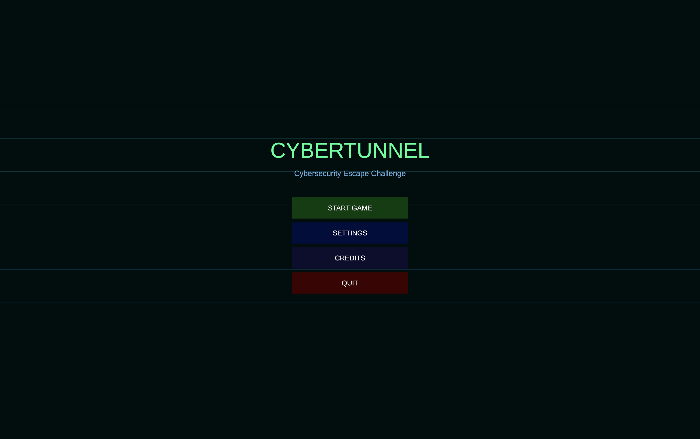
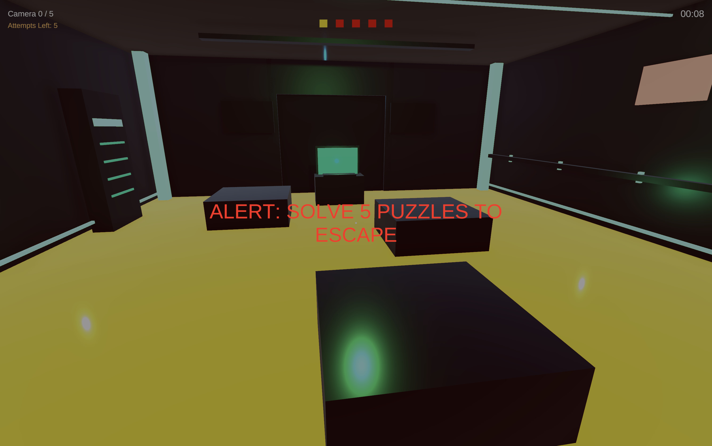
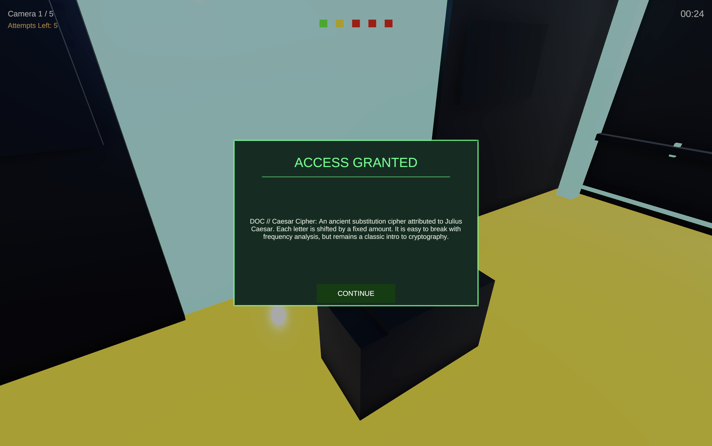
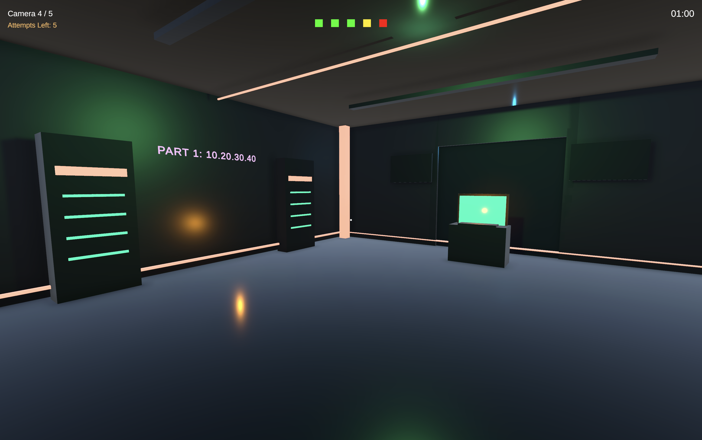
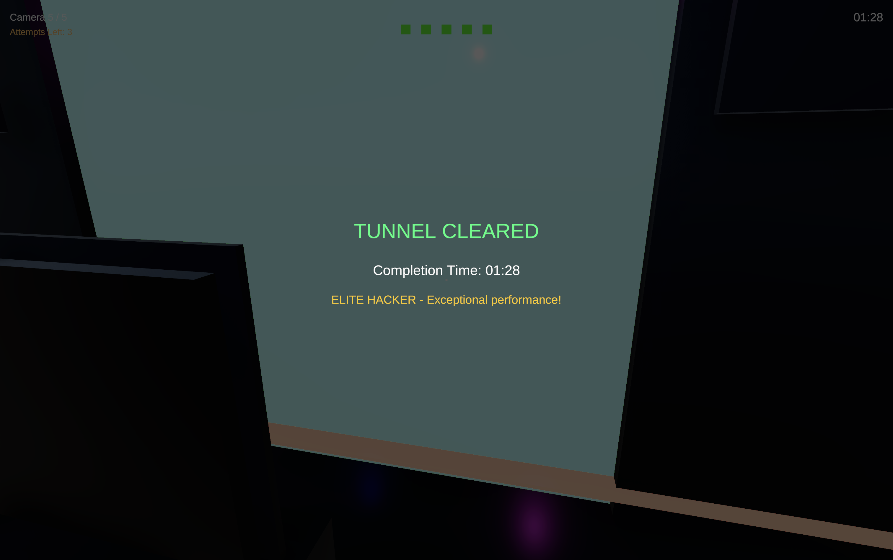
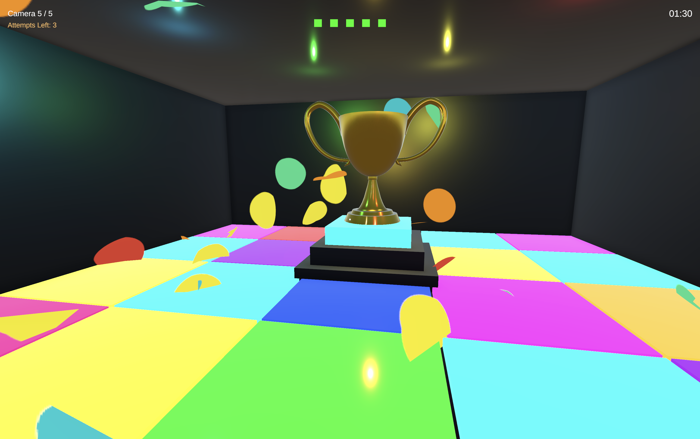

# CyberTunnel — Cybersecurity Escape Room

Joc first-person puzzle educațional construit în Unity (URP). Jucătorul este blocat într-un tunel subteran de securitate cibernetică și trebuie să rezolve 5 puzzle-uri de criptografie și securitate pentru a scăpa.

## Concept

**Gen:** First-Person Puzzle / Educațional  
**Motor:** Unity 2022.3 LTS (Universal Render Pipeline)  
**Jucători:** Single player  
**Temă:** Securitate cibernetică, criptografie, rețele

### Poveste

Ești un trainee în securitate cibernetică blocat într-o facilitate simulată subterană. Pentru a-ți dovedi abilitățile și a obține certificarea, trebuie să treci prin 5 camere securizate. Fiecare cameră testează o abilitate diferită — de la criptografie clasică la noțiuni moderne de securitate.

---

## Condiție de victorie

Rezolvă toate 5 puzzle-urile și ajunge în camera cu trofeu. Timpul de completare determină rank-ul final.

| Timp | Rank |
|------|------|
| < 3 min | ELITE HACKER |
| < 5 min | SKILLED ANALYST |
| < 10 min | JUNIOR OPERATIVE |
| > 10 min | TRAINEE |

---

## Cele 5 Camere

### Camera 1 — Caesar Cipher (podea de lavă)
- **Concept:** Un mesaj criptat cu cifrul Caesar apare pe terminal
- **Provocare:** Jucătorul decriptează mesajul folosind valoarea shift-ului (3)
- **Exemplu:** `RSHQ SRUW 443` cu shift 3 → `OPEN PORT 443`
- **Relevanță:** Criptografie clasică, bazele cifrării
- **Pericol:** Podeaua este lavă — cazi = pierzi o încercare, reapari la intrare

### Camera 2 — Vigenere Cipher
- **Concept:** Mesaj criptat cu cifrul Vigenere folosind un cuvânt-cheie
- **Provocare:** Jucătorul folosește cheia pentru a decripta mesajul
- **Exemplu:** `HKVIYCNN` cu cheie `CYBER` → `FIREWALL`
- **Relevanță:** Cifru polialfabetic, criptare bazată pe cheie

### Camera 3 — Binary Decode
- **Concept:** Un comandă codificată în binar apare pe ecran
- **Provocare:** Jucătorul convertește binar → ASCII pentru a găsi comanda
- **Exemplu:** `01000001 01001100 01001100 01001111 01010111` → `ALLOW`
- **Relevanță:** Codificare binară, reprezentare ASCII

### Camera 4 — IP ↔ Binary
- **Concept:** Pe pereți apar două reprezentări ale unei adrese IPv4: format zecimal și format binar
- **Provocare:** Jucătorul convertește IPv4 → IP binar, apoi IP binar → IPv4
- **Exemplu IPv4 → IP binar:** `10.20.30.40` → `00001010.00010100.00011110.00101000`
- **Exemplu IP binar → IPv4:** `10101100.00010000.11111110.00000001` → `172.16.254.1`
- **Relevanță:** Rețele, adresare IPv4, reprezentarea binară a octeților

### Camera 5 — Cybersecurity Definitions
- **Concept:** Completare de spații libere cu termeni de securitate cibernetică
- **Provocare:** Jucătorul completează definiții cu termeni: Firewall, Encryption, Phishing, Malware, Authentication
- **Relevanță:** Cunoștințe fundamentale de securitate cibernetică

---

## Camera Finală — Sala Trofeului

- Jucătorul este întâmpinat cu efect de confetti (asset Lana Studio)
- Trofeu 3D (`WinnerCup.fbx`) colorat în auriu, plasat pe podium
- Ecran de final cu timp de completare și rank

---

## Sistem Audio

- **Muzică de fundal:** buclă continuă, repornește la retry
- **Sunet deschidere/închidere uși:** redat la fiecare interacțiune cu ușa
- **Sunet "YOU LOST":** redat imediat la 0 încercări rămase, înainte de freeze
- **Sunet lavă:** sizzle + scream la căderea în lavă
- **Sunet nivel deblocat:** la rezolvarea fiecărui puzzle
- Volumul muzicii și SFX-ului se controlează din meniul principal (Settings)

---

## Structura Proiectului

```
Assets/
├── Scenes/
│   ├── MainMenu.unity          # Meniu principal
│   └── GameScene.unity         # Tunelul cu toate 5 camerele
├── Scripts/
│   ├── Core/
│   │   ├── GameManager.cs          # Stare joc, progresie camere, timer
│   │   ├── AudioManager.cs         # SFX și muzică (singleton DontDestroyOnLoad)
│   │   ├── LavaRespawnZone.cs      # Detectare cădere în lavă + respawn
│   │   └── ConfettiTrigger.cs      # Declanșare confetti la intrarea în sala trofeului
│   ├── Player/
│   │   ├── PlayerController.cs     # Mișcare FPS (WASD + mouse)
│   │   └── PlayerInteraction.cs    # Sistem interacțiune raycast (tasta E)
│   ├── Puzzles/
│   │   ├── PuzzleBase.cs           # Clasă abstractă bază pentru puzzle-uri
│   │   ├── CaesarCipherPuzzle.cs
│   │   ├── VigenereCipherPuzzle.cs
│   │   ├── BinaryDecodePuzzle.cs
│   │   ├── HashMatchingPuzzle.cs
│   │   ├── IPBinaryPuzzle.cs
│   │   └── DefinitionsPuzzle.cs
│   ├── Room/
│   │   ├── Room.cs                 # Stare cameră și legătura cu puzzle-ul
│   │   ├── Door.cs                 # Uși animate (blocate/deblocate) cu sunet
│   │   └── PuzzleTerminal.cs       # Terminal interactiv
│   ├── UI/
│   │   ├── PuzzleUIManager.cs      # Afișare puzzle și input text/butoane
│   │   ├── HUDManager.cs           # Timer, progres camere, crosshair, ecran final
│   │   ├── MainMenuUI.cs           # Start, Settings (volum), Credits, Quit
│   │   └── PauseMenuUI.cs          # Pauză cu ESC
│   └── Editor/
│       └── CyberTunnelBuilder.cs   # Editor script — generează automat toată scena
├── Models/
│   └── WinnerCup.fbx               # Model 3D trofeu
├── Resources/
│   └── Audio/                      # Fișiere audio încărcate dinamic
├── Lana Studio/
│   └── Hyper Casual FX/            # Asset pack confetti (Confetti_blast_multicolor etc.)
├── Materials/                      # Materiale cyber-neon (generate de builder)
└── Audio/                          # Fișiere audio suplimentare
```

---

## Controale

| Tastă | Acțiune |
|-------|---------|
| WASD | Mișcare |
| Mouse | Privit în jur |
| E | Interacțiune terminal |
| Shift | Sprint |
| ESC | Meniu pauză |

---

## Generare Scenă

Scena de joc este construită **programatic** printr-un Editor Script:

`Tools → Cyber Tunnel Builder → Build GameScene`

Scriptul `CyberTunnelBuilder.cs` generează automat:
- Toate cele 5 camere cu pereți, podea, tavan
- Coridoare între camere
- Uși cu animație și script de interacțiune
- Terminale interactive în fiecare cameră
- Sistem de iluminat neon pe cameră
- Elemente decorative (rack-uri servere, conducte cabluri, panouri)
- Zona finală cu podium, trofeu 3D auriu și confetti
- AudioManager, GameManager, HUD, PlayerController — toate configurate automat

---

## Instrucțiuni Setup

1. Clonează repo-ul: `git clone <url>`
2. Deschide în Unity Hub → Add project from disk
3. Așteaptă importul Unity
4. Deschide `Assets/Scenes/MainMenu.unity`
5. Apasă Play **sau** deschide `GameScene.unity` și apasă Play direct

---

## Cerințe Tehnice

- **Unity:** 2022.3 LTS sau mai nou
- **Render Pipeline:** Universal Render Pipeline (URP)
- **Limbaj:** C#
- **Text rendering:** TextMeshPro
- **Fizică player:** CharacterController
- **Interacțiune:** Physics.Raycast

---

## Galerie

### 1. Meniu principal


*Meniul principal CyberTunnel, cu opțiunile de start, setări, credite și ieșire.*

### 2. Intrarea în joc


*Alerta inițială anunță obiectivul: rezolvarea celor 5 puzzle-uri pentru evadare.*

### 3. Puzzle rezolvat


*Primul acces este deblocat după rezolvarea puzzle-ului Caesar Cipher.*

### 4. Cameră avansată


*O cameră cyber-neon cu indiciu IP și terminal pregătit pentru următoarea provocare.*

### 5. Ecran final


*Rezultatul final afișează timpul de completare și rank-ul obținut.*

### 6. Sala trofeului


*Trofeul de final marchează evadarea reușită, cu podium colorat și confetti.*